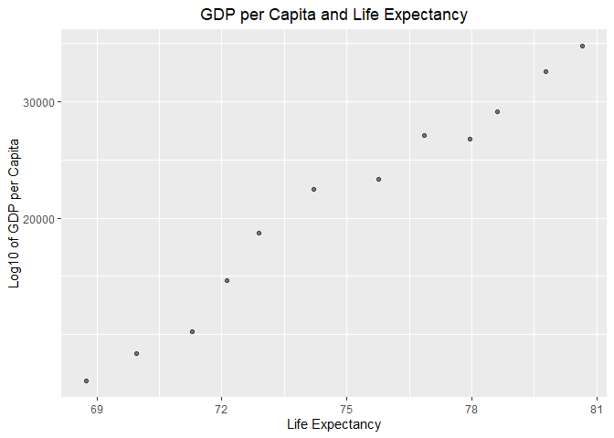
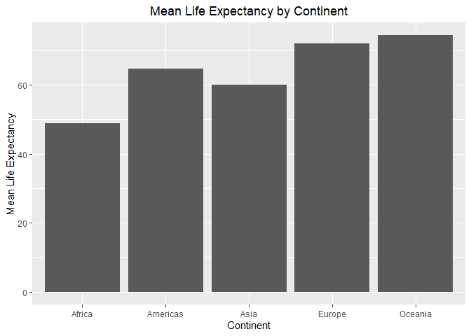
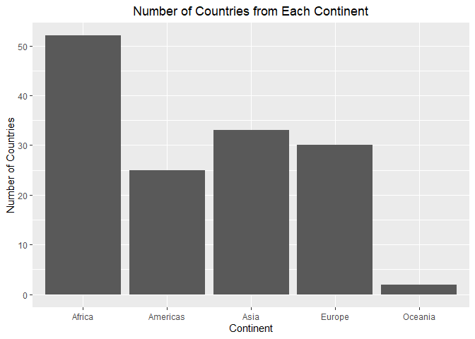
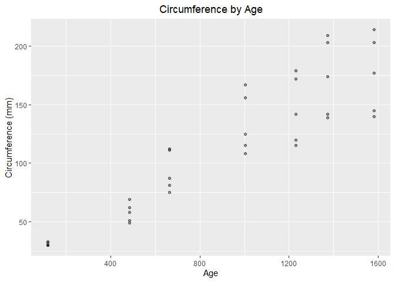
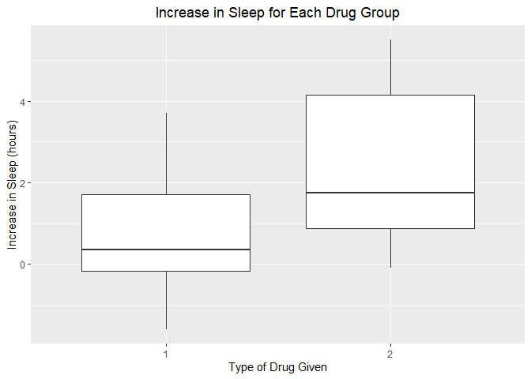

---------

# Exercise 1.1

__Use filter() to subset the gapminder data to three countries of your choice in the 1970’s.__


```r
gapminder %>%
  filter(country == "Canada" | 
         country == "New Zealand" | 
         country == "United States") %>%
  filter(year >= "1970" &
           year <= "1979") %>%
  knitr::kable()
```


country         continent    year   lifeExp         pop   gdpPercap
--------------  ----------  -----  --------  ----------  ----------
Canada          Americas     1972     72.88    22284500    18970.57
Canada          Americas     1977     74.21    23796400    22090.88
New Zealand     Oceania      1972     71.89     2929100    16046.04
New Zealand     Oceania      1977     72.22     3164900    16233.72
United States   Americas     1972     71.34   209896000    21806.04
United States   Americas     1977     73.38   220239000    24072.63

# Exercise 1.2

__Use the pipe operator %>% to select “country” and “gdpPercap” from your filtered dataset in 1.1.__


```r
gapminder %>%
  filter(country == "Canada" | 
         country == "New Zealand" | 
         country == "United States") %>%
  filter(year >= "1970" &
           year <= "1979") %>%
  select(country, gdpPercap) %>%
  knitr::kable()
```


country          gdpPercap
--------------  ----------
Canada            18970.57
Canada            22090.88
New Zealand       16046.04
New Zealand       16233.72
United States     21806.04
United States     24072.63


# Exercise 1.3

__Filter gapminder to all entries that have experienced a drop in life expectancy. Be sure to include a new variable that’s the increase in life expectancy in your tibble. Hint: you might find the lag() or diff() functions useful.__


```r
gap_inc <- gapminder %>%
  arrange(year) %>%
  group_by(country) %>%
  mutate(increaselifeExp = lifeExp -lag(lifeExp)) %>%
  filter(increaselifeExp < 0) %>%
  knitr::kable()
```
*Note: Did not included printed kable because there are many many rows.*


# Exercise 1.4

__Choose one of the following:__

__Filter gapminder so that it shows the max GDP per capita experienced by each country. Hint: you might find the max() function useful here.__

__OR__

__Filter gapminder to contain six rows: the rows with the three largest GDP per capita, and the rows with the three smallest GDP per capita. Be sure to not create any intermediate objects when doing this (with, for example, the assignment operator). Hint: you might find the sort() function useful, or perhaps even the dplyr::slice() function.__


```r
gapminder %>%
  group_by(country) %>%
  filter(gdpPercap == max(gdpPercap))
```

```
## # A tibble: 142 x 6
## # Groups:   country [142]
##    country     continent  year lifeExp       pop gdpPercap
##    <fct>       <fct>     <int>   <dbl>     <int>     <dbl>
##  1 Afghanistan Asia       1982    39.9  12881816      978.
##  2 Albania     Europe     2007    76.4   3600523     5937.
##  3 Algeria     Africa     2007    72.3  33333216     6223.
##  4 Angola      Africa     1967    36.0   5247469     5523.
##  5 Argentina   Americas   2007    75.3  40301927    12779.
##  6 Australia   Oceania    2007    81.2  20434176    34435.
##  7 Austria     Europe     2007    79.8   8199783    36126.
##  8 Bahrain     Asia       2007    75.6    708573    29796.
##  9 Bangladesh  Asia       2007    64.1 150448339     1391.
## 10 Belgium     Europe     2007    79.4  10392226    33693.
## # ... with 132 more rows
```


# Exercise 1.5

__Produce a scatterplot of Canada’s life expectancy vs. GDP per capita using ggplot2, without defining a new variable. That is, after filtering the gapminder data set, pipe it directly into the ggplot() function. Ensure GDP per capita is on a log scale.__


```r
gapminder %>%
  filter(country == "Canada") %>%
  ggplot(aes(lifeExp, gdpPercap)) +
  geom_point(alpha = 0.5) +
  scale_y_log10() +
  labs(title = "GDP per Capita and Life Expectancy", x = "Life Expectancy", y = "Log10 of GDP per Capita") +
  theme(plot.title = element_text(hjust = 0.5))
```

<!-- -->

---------

# Exercise 2

__Pick one categorical variable and one quantitative variable to explore. Answer the following questions in whichever way you think is appropriate, using dplyr:__

__What are possible values (or range, whichever is appropriate) of each variable?__

__What values are typical? What’s the spread? What’s the distribution? Etc., tailored to the variable at hand.__

__Feel free to use summary stats, tables, figures.__


## Exploring "Life Expectancy" Variable

The range of life expectancy in this dataset is 23.6 years to 82.6 years.


```r
range(gapminder$lifeExp)
```

```
## [1] 23.599 82.603
```


#### Plot of the average life expectancy of each continent


```r
gapminder %>%
  group_by(continent) %>%
  summarise(meanlifeExp = mean(lifeExp)) %>%
  ggplot(aes(continent, meanlifeExp)) +
  geom_bar(stat = "identity") +
  labs(title = "Mean Life Expectancy by Continent", 
       x = "Continent", 
       y = "Mean Life Expectancy") +
  theme(plot.title = element_text(hjust = 0.5))
```

<!-- -->


## Exploring "Continent" and "Country" Variables

*The following shows the number of countries from each continent in this the "gapminder" dataset.*


```r
gapminder %>%
  group_by(continent) %>%
  summarize(n_of_countries = n_distinct(country)) %>%
  knitr::kable()
```


continent    n_of_countries
----------  ---------------
Africa                   52
Americas                 25
Asia                     33
Europe                   30
Oceania                   2


```r
gapminder %>%
  group_by(continent) %>%
  summarize(n_countries = n_distinct(country)) %>%
  ggplot(aes(continent, n_countries)) +
  geom_bar(stat = "identity") +
  labs(title = "Number of Countries from Each Continent", x = "Continent", y = "Number of Countries") +
  theme(plot.title = element_text(hjust = 0.5))
```

<!-- -->

---------

# Exercise 3
__Make two plots that have some value to them. That is, plots that someone might actually consider making for an analysis. Just don’t make the same plots we made in class – feel free to use a data set from the datasets R package if you wish.__

__A scatterplot of two quantitative variables.__
__One other plot besides a scatterplot.__
__You don’t have to use all the data in every plot! It’s fine to filter down to one country or a small handful of countries.__


## Scatterplot made using "Orange" dataset

### Information about "Orange" dataset
*From [https://stat.ethz.ch/R-manual/R-devel/library/datasets/html/Orange.html](https://stat.ethz.ch/R-manual/R-devel/library/datasets/html/Orange.html)*


*"Tree*

*an ordered factor indicating the tree on which the measurement is made. The ordering is according to increasing maximum diameter.*


*age*

*a numeric vector giving the age of the tree (days since 1968/12/31)*


*circumference*

*a numeric vector of trunk circumferences (mm). This is probably “circumference at breast height”, a standard measurement in forestry."*


### Plot of the age and the circumference of orange trees


```r
data(Orange)
Orange %>%
  ggplot(aes(age, circumference)) +
  geom_point(alpha = 0.4) +
  labs(title = "Circumference by Age", x = "Age", y = "Circumference (mm)") +
  theme(plot.title = element_text(hjust = 0.5))
```

<!-- -->


## Boxplot made using the "sleep" dataset

### Information about "sleep" dataset

*The following is an exploration of the "sleep" dataset.*
*From: [https://stat.ethz.ch/R-manual/R-devel/library/datasets/html/sleep.html](https://stat.ethz.ch/R-manual/R-devel/library/datasets/html/sleep.html)*

*"Data which show the effect of two soporific drugs (increase in hours of sleep compared to control) on 10 patients."*

Variables | Explanation
----------|----------
extra	| "increase in hours of sleep" |
group |	"drug given" |
ID |	"patient ID" |

### Boxplot of Increase in Sleep


```r
data(sleep)
sleep %>%
  group_by(group) %>%
  ggplot(aes(group, extra)) +
  geom_boxplot() +
  labs(title = "Increase in Sleep for Each Drug Group", x = "Type of Drug Given", y = "Increase in Sleep (hours)") +
  theme(plot.title = element_text(hjust = 0.5))
```

<!-- -->


