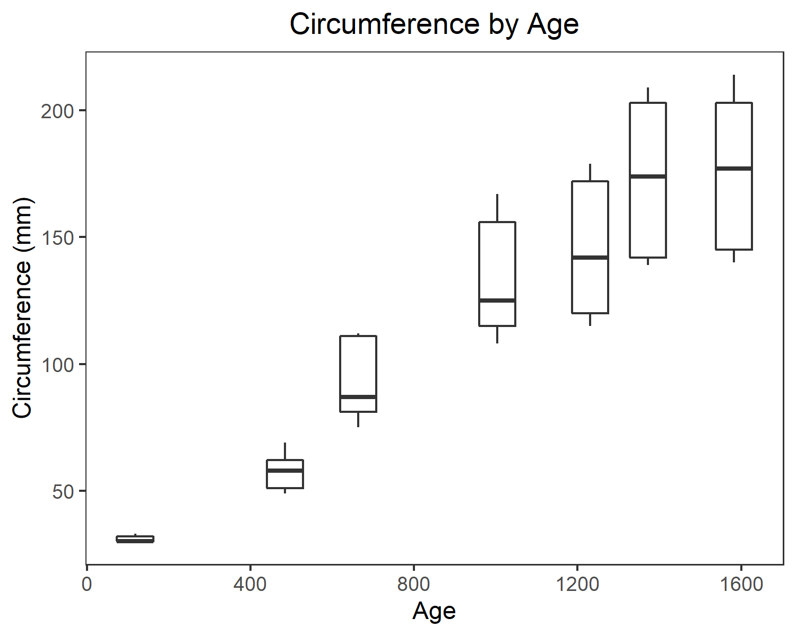

```{r setup, echo = FALSE, include=FALSE}
knitr::opts_chunk$set(echo = TRUE)
```

```{r, echo = FALSE, warning = FALSE}
suppressPackageStartupMessages(library(tidyverse))
suppressPackageStartupMessages(library(tidyr))
suppressPackageStartupMessages(library(forcats))
suppressPackageStartupMessages(library(ggplot2))
suppressPackageStartupMessages(library(dplyr))
suppressPackageStartupMessages(library(gapminder))
suppressPackageStartupMessages(library(DT))
suppressPackageStartupMessages(library(plotly))
suppressPackageStartupMessages(library(gridExtra))
```


# Exercise 1: Explain the value of the here::here package

## 1.1 In your own words, summarize the value of the here::here package in 250 words or fewer.

From my understanding, the here::here package is valuable because it allows you to more easily specify where you want a file to be created. It makes the data more accessible to other people (and across operating systems) as well. 


# Exercise 2: Factor management

## 2.1. Choose one dataset and a variable to explore.

The data set that I will explore is 'gapminder' and the variable is 'country'.

```{r, read in gapminder dataset}
data(gapminder)
gapminder
```

```{r, confirm that variable of interest is a factor}
CO2$Treatment %>%
  str()
```

## 2.2. After ensuring the variable(S) you're exploring are indeed factors, you should:

### 2.2.1. Drop factor/levels;_
```{r, drop factor(s)}
new_gap <- gapminder %>%
  filter(country %in% c("Norway", "Germany", "Chile", "Canada", "Uganda", "Italy"))

new_gap$country %>%
  nlevels()
```

```{r}
new_gap_dropped <- new_gap %>%
  droplevels()
new_gap_dropped
```


## 2.3. Explore the effects of re-leveling a factor in a tibble by:

### 2.3.1. Comparing the results of `arrange` on the original and re-leveled factor.

Now that the data have been filtered and unused levels dropped, we can create bar plots to see how many entries are present in each continent of interest. 
Let's see what using 'arrange' looks like first. 
```{r}
new_gap_dropped %>%
  arrange(continent) %>%
  ggplot(aes(continent)) +
  geom_bar() +
  theme_bw() +
  labs(title = "Before Reordering", x = "Continents", y = "Count of Entries")
```


### 2.3.2. Plotting a figure of before/after re-leveling the factor (make sure to assign the factor to an aesthetic of your choosing).

Now let's use the fct_reorder function to put the bars in order of maximum life expectancy.
```{r}
new_gap_dropped %>%
  ggplot() +
  geom_bar(aes(fct_reorder(continent, lifeExp, max))) +
  theme_bw() +
  labs(title = "After Reordering based on Maximum Life Expectancy", x = "Continents", y = "Count of Entries")
```


# Exercise 3: File input/output (I/O)

## 3.1. Experiment with at least one of:

### - `write_csv()/read_csv()`
Here I am going to read in a very trimmed down .csv file of some data from my undergraduate research on spiders in grasslands. I'm not sure how to prevent R from reading in the blank columns and blank rows... There should be 8 columns and 133 rows of data. Any helpful information here would be great. 
```{r, warning = FALSE}
spiders <- read_csv(here::here("spiderdata", "spiders_stats545.csv"))
spiders
```


# Exercise 4: Visualization design

## 4.1. Recreate at least one figure in light of something you learned in the recent class meetings about visualization design and color.

## 4.2. Create a side-by-side plot and juxtapose your first attempt (show the original figure as-is) with a revised attempt after some time spent working on it and implementing principles of effective plotting principles. Comment and reflect on the differences.

For these two exercises, I am using a figure that I created during Homework 2 using the 'Orange' dataset.
```{r, fig.width = 15}
data(Orange)

#old graph
graph1 <- Orange %>%
  ggplot(aes(age, circumference)) +
  geom_point(alpha = 0.4) +
  labs(title = "Circumference by Age", x = "Age", y = "Circumference (mm)") +
  theme(plot.title = element_text(hjust = 0.5))

#new graph
graph2 <- Orange %>%
  ggplot(aes(age, circumference, group = age)) +
  geom_boxplot() +
  labs(title = "Circumference by Age", x = "Age", y = "Circumference (mm)") +
  theme_bw() +
  theme(panel.grid.major = element_blank(), panel.grid.minor = element_blank(), plot.title = element_text(hjust = 0.5))
  
grid.arrange(graph1, graph2, nrow = 1)

```

To recreate this file using the new material that we have learned, I am going to use certain features of ggplot to create a more effective graph - including removing the grid lines and grey background of the plot. I switched to using a boxplot because I think it represents that differences in circumference at different ages better. It shows the variation in data rather than just the single data points.   


# Exercise 5: Writing figures to file

## 5.1. Task: Use `ggsave()` to explicitly save a plot to file. Include the exported plot as part of your repository and assignment.


I am going to use the new graph that I created in Exercise 4 for this exercise.

First, I'll save the graph using the defaults of 'ggsave()'. This saves a 7 by 7 inch .png file. 
```{r}
ggsave("orange_boxplot.png")
```


### Then, use `` to load and embed that file into your report. You can play around with various options, such as:

### - Arguments of `ggsave()`, such as width, height, resolution or text scaling.

Change the dimensions and resolution:
```{r}
ggsave("resized_orange_boxplot.png", width = 5, height = 4, dpi = 150)
```

### - Various graphics devices, e.g. a vector vs. raster format.

Change the output format:
```{r}
ggsave("jpeg_orange_boxplot.jpeg")
```

### - Explicit provision of the plot object `p` via `ggsave(..., plot = p)`. Show a situation in which this actually matters.

How to specify which graph to save. ggsave() defaults to saving the last plot.
```{r}
ggsave("old_orange_graph.png", plot = graph1)
```


Embedded graph:
```{r}
ggsave("new_orange_plot.png", width = 5, height = 4, units = "in", plot = graph2)
```




